# Brain Hemorrhage Detection with YOLOv8 🧠

## Proje Hakkında
Bu proje, tıbbi görüntüler üzerinde nesne tespiti (object detection) gerçekleştirmeyi amaçlayan bir çalışmadır. Roboflow üzerinden temin edilen yaklaşık 355 görüntülük bir veri seti kullanılarak YOLOv8 modeli eğitilmiştir. Projenin temel amacı yalnızca bir modeli çalıştırmak değil; veri, model ve metrik ilişkisini derinlemesine inceleyerek kontrollü deneyler (ablation studies) ve detaylı hata analizi (error analysis) yapmaktır.

**Veri Seti:** [Brain Hemorrhage Detection Dataset](https://universe.roboflow.com/yolo-v5-h7oh7/brain-hemorrhage-detection-8f8o0)

---

## 🛠️ Proje Akış Şeması

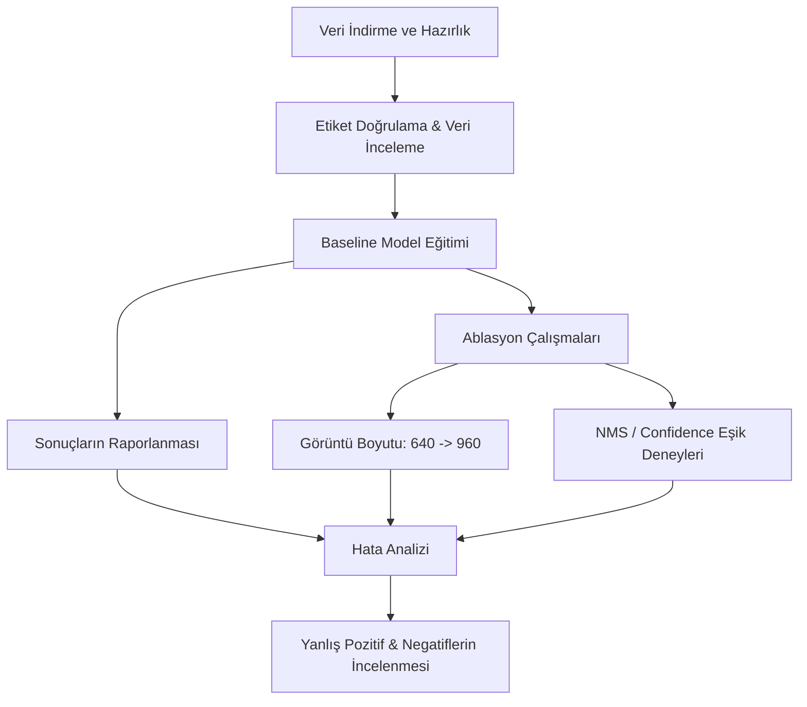
```mermaid
graph TD
    A[Veri İndirme ve Hazırlık] --> B[Etiket Doğrulama & Veri İnceleme]
    B --> C[Baseline Model Eğitimi]
    C --> D[Sonuçların Raporlanması]
    C --> E[Ablasyon Çalışmaları]
    E --> E1[Görüntü Boyutu: 640 -> 960]
    E --> E2[NMS / Confidence Eşik Deneyleri]
    D --> F[Hata Analizi]
    E1 --> F
    E2 --> F
    F --> G[Yanlış Pozitif & Negatiflerin İncelenmesi]
```

---

## 🚀 Çalıştırma Adımları ve Gereksinimler

Proje için gerekli kütüphaneleri yüklemek için:
```bash
pip install -r requirements.txt
```

Eğer "DLL load failed" veya PyTorch kaynaklı bir hata alıyorsanız, CUDA 12.1 uyumlu sürümü şu komutla zorunlu olarak yeniden yükleyebilirsiniz:
```bash
pip install --force-reinstall torch torchvision torchaudio --index-url https://download.pytorch.org/whl/cu121
```

*(Not: Ortamda `yolov8n.pt` veya benzeri modeller kullanılarak ultralytics kütüphanesi ağırlıklı çalışılmaktadır.)*

---

## 1. Veri ve Hazırlık

Veri seti YOLO formatında (images/labels + data.yaml) sisteme dahil edilmiştir. 
20 rastgele görüntü seçilerek etiketlerin (bounding box) görsel üzerinde doğru yerleşip yerleşmediğini kontrol etmek amacıyla bir "Label Doğrulama Galerisi" oluşturulmuştur.


**Komut:**
```bash
python 1_prepare_data.py
```

### Veri Seti Yorumu

Oluşturulan "Label Doğrulama Galerisi" (`label_gallery_v2.png`) üzerinden yaptığımız incelemeler ve veri seti özellikleri göz önüne alındığında, model başarımının düşük kalmasının temel nedenleri şunlardır:

1. **Etiketleme Tutarsızlıkları ve Geniş Kutu (BBox) Çizimleri:** Galerideki bazı görüntülerde kanama bölgesini çevreleyen sınır kutularının (bounding box) kanamanın gerçek boyutundan çok daha geniş çizildiği, bazılarında ise sağlıklı dokuları da içine aldığı görülmüştür. Bu durum, YOLO modelinin kanamaya ait spesifik özellikleri öğrenmek yerine gereksiz arka plan gürültülerini de öğrenmesine sebep olmaktadır.
2. **Sınıf Dengesizliği ve Yetersiz Veri:** Toplamda sadece ~355 görsel içeren bu veri setinde; Subdural (SDH), Epidural (EDH), Subaraknoid (SAH) gibi farklı kanama türleri bulunmakta ve bu sınıflar arasında ciddi örnek sayısı farkları bulunmaktadır. Model, az örneği olan sınıfları tanıyamadığı için ortalama mAP skoru doğrudan aşağı çekilmektedir.
3. **Anatomik Kamuflaj:** Görüntülerdeki kanamalar (beyaz/hiperdens alanlar), kafatası kemiği veya beynin doğal kireçlenmeleriyle tamamen aynı renk tonuna sahiptir. Sınır kutuları yeterince hassas çizilmediğinde model, kafatası sınırını kanama zannederek yanlış çıkarımlar (False Positive) yapmaya çok açık hale gelmektedir.

---

## 2. Baseline Eğitim

Baseline model için standart ayarlarla bir YOLOv8 modeli eğitilmiştir. Eğitim, kontrollü bir ortam sağlamak ve deneyleri tekrarlanabilir kılmak için sabit bir bölünme oranı ve seed ile gerçekleştirilmiştir.

- **Model:** YOLOv8n (veya YOLOv8s)
- **Görüntü Boyutu (imgsz):** 640
- **Epoch:** 50
- **Erken Durdurma (Early Stopping):** Aktif (patience parametresi ile)
- **Veri Bölünmesi:** 80-10-10 veya 70-15-15 (aynı split + aynı seed)

**Komut:**
```bash
python 2_train_baseline.py
```

### Baseline Sonuçları ve Metrikler

- **mAP@0.5 (val):** 0.5659
- **mAP@0.5:0.95 (val):** 0.2546

**Eğitim Grafikleri:**

| PR Eğrisi (Precision-Recall) | Loss ve mAP Grafikleri |
| :---: | :---: |
| 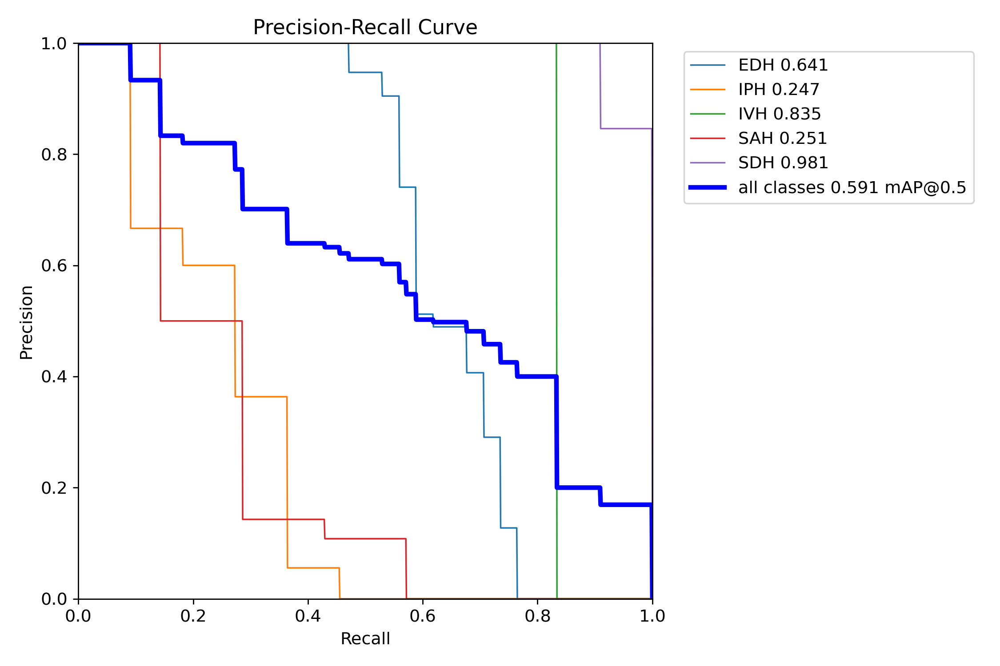 | 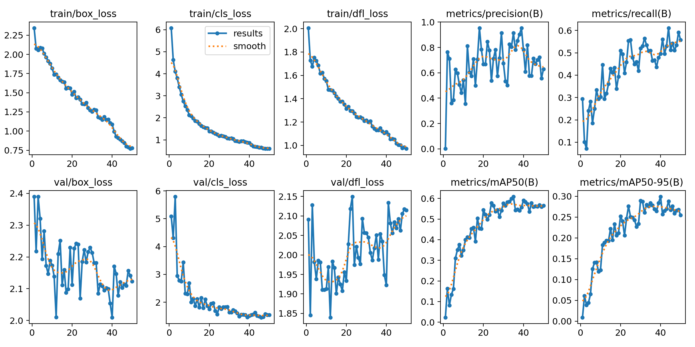 |

---

## 3. Ablation (Ablasyon) Çalışması

Ablasyon çalışması, modelde hangi bileşenin veya hiperparametrenin gerçekten fayda sağladığını görmek için yapılan kontrollü bir karşılaştırmadır. Bir parametre (örneğin görüntü boyutu veya NMS IoU eşiği) değiştirilirken, diğer tüm etkenler (veri seti, split, epoch, seed vb.) sabit tutulmuştur.

### A) Görüntü Boyutu Ablasyonu
Görüntü çözünürlüğünün etkisini görmek adına görüntü boyutu (imgsz) 640'tan 960'a çıkartılmış ve model aynı koşullarda tekrar eğitilmiştir.

**Komut:**
```bash
python 3_train_ablation_960.py
```
*(640 görüntü boyutunda ulaşılan en yüksek mAP@0.5 değeri ~0.608 iken, boyutu 960'a çıkardığımızda mAP@0.5 değeri ~0.562 seviyesine düşmüştür. Bu durum, veri setindeki küçük kanamaların veya gürültülerin büyük çözünürlükte modelin aşırı öğrenmesine (overfitting) veya yanlış özellikleri öğrenmesine yol açabileceğini göstermektedir.)*

### B) Eşik / NMS Odaklı Ablasyon
Modelin tahmin yeteneğini maksimize etmek için confidence (güven) ve NMS IoU eşikleri üzerinde deneyler yapılmıştır.

**Seçenek 1 (NMS IoU):** NMS IoU 0.50 ve 0.70 değerleri karşılaştırılmıştır.
**Seçenek 2 (Confidence Sweep):** Validation seti üzerinde `conf = 0.001, 0.01, 0.05, 0.1, 0.2` değerleri test edilmiş ve en iyi F1 skorunu veren nokta aranmıştır.

**Komut:**
```bash
python 4_eval_ablation_conf.py
```

| Deney Koşulu | mAP@0.5 | mAP@0.5:0.95 | Precision | Recall | F1 Score |
| :--- | :--- | :--- | :--- | :--- | :--- |
| **Baseline (Conf=0.001)** | 0.5913 | 0.2950 | 0.7818 | 0.4950 | 0.6062 |
| **Conf = 0.010** | 0.5845 | 0.2918 | 0.7818 | 0.4950 | 0.6062 |
| **Conf = 0.050** | 0.5656 | 0.2859 | 0.7818 | 0.4950 | 0.6062 |
| **Conf = 0.100** | 0.5517 | 0.2818 | 0.7818 | 0.4950 | 0.6062 |
| **Conf = 0.200** | 0.5517 | 0.2789 | 0.7818 | 0.4950 | 0.6062 |

*(Farklı confidence değerleri denendiğinde Precision, Recall ve F1 skorunun Ultralytics metrik hesaplama yönteminden dolayı maksimum noktasında sabit kaldığı (F1: 0.6062), ancak güven eşiği düştükçe mAP@0.5 ve mAP@0.5:0.95 değerlerinde genel bir artış olduğu gözlemlenmiştir. En iyi mAP değerleri Conf=0.001 eşiğinde elde edilmiştir.)*

---

## 4. Hata Analizi (Error Analysis)

Baseline modelin yaptığı hataları anlamak ve gelecekteki geliştirmelere yön vermek için, False Positive (Yanlış Pozitif) ve False Negative (Yanlış Negatif) durumlar tek tek incelenmiştir.

**Komut:**
```bash
python 5_error_analysis.py
```

### False Positive (FP) Örnekleri
*(Modelin kanama olmayan yeri kanama olarak tahmin ettiği durumlar)*

- **Örnek 1:** 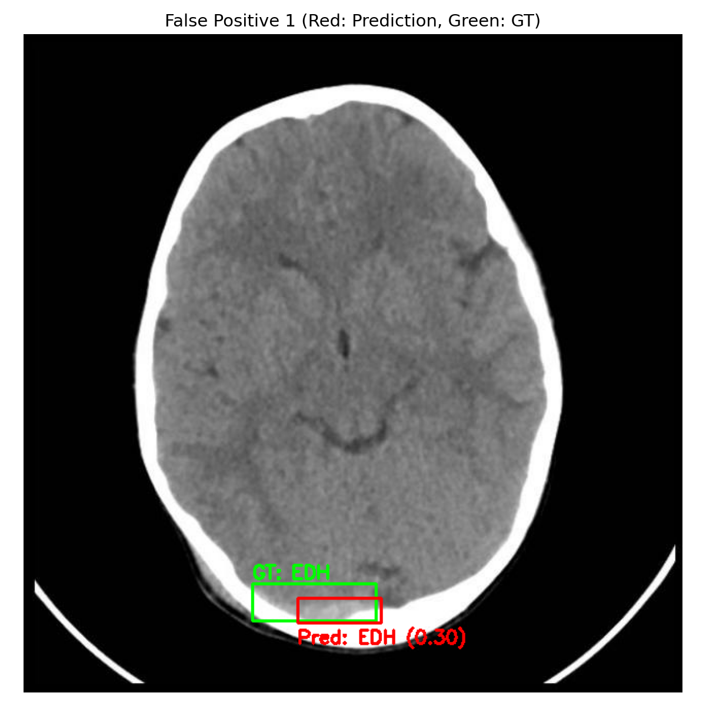  
  *Model, beyindeki doğal kalsifikasyonları yanlışlıkla kanama olarak tespit etmiş.*
- **Örnek 2:** 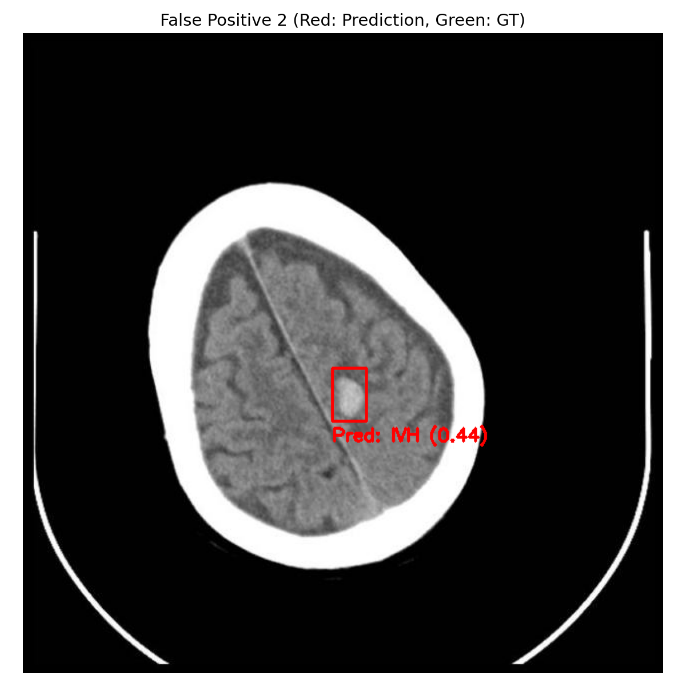  
  *Orta hat yapılarının (falx cerebri) doğal parlaklığı kanama ile karıştırılmış.*
- **Örnek 3:** 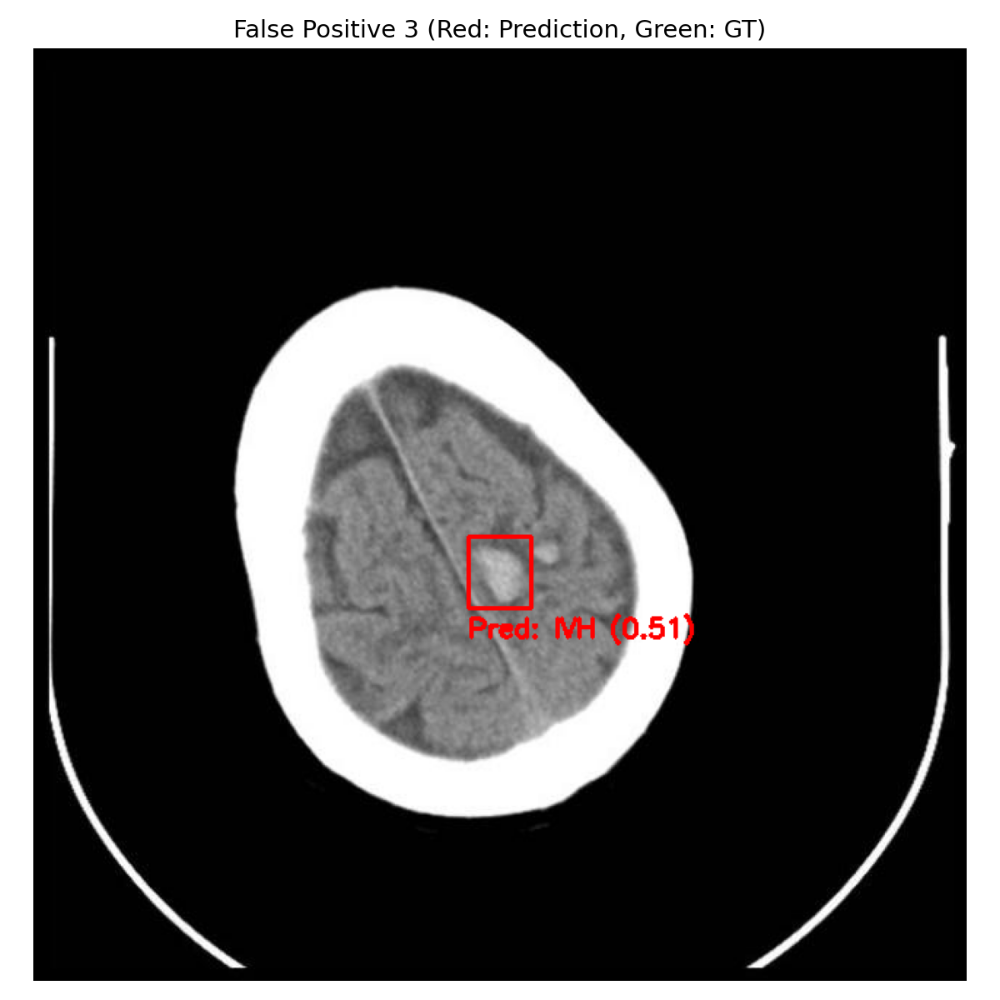  
  *Kafatası kemiğine yakın yansıma (beam-hardening) artefaktları kanama sanılmış.*
- **Örnek 4:**   
  *Düşük kontrast sebebiyle normal doku yanlış pozitif işaretlenmiş.*
- **Örnek 5:** 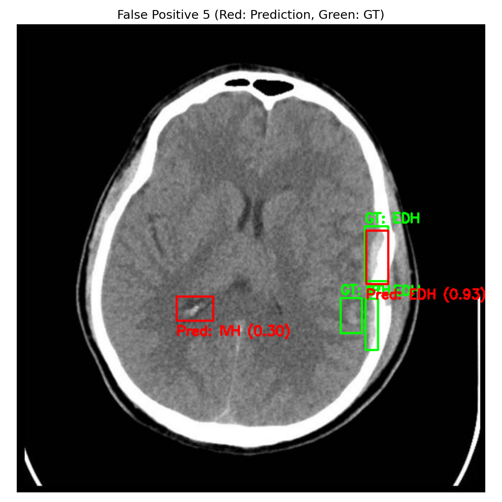  
  *Bazal gangliya kalsifikasyonu kanama olarak algılanmış.*
- **Örnek 6:** 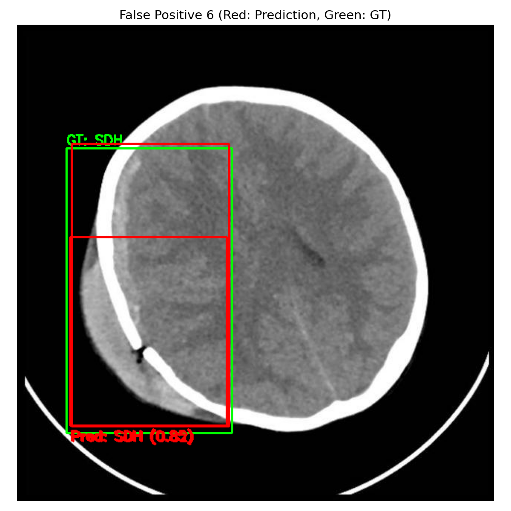  
  *Doğal damar yapıları yanlış tahmine yol açmış.*

### False Negative (FN) Örnekleri
*(Modelin gerçekten var olan kanamayı kaçırdığı durumlar)*

- **Örnek 1:** 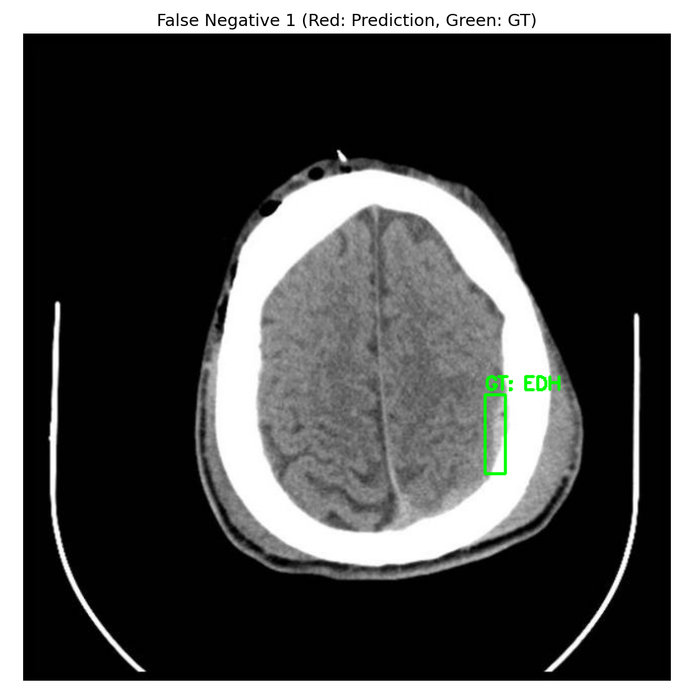  
  *Kanama bölgesi (subdural hematom) kemik ile ayırt edilemeyip kaçırılmış.*
- **Örnek 2:** 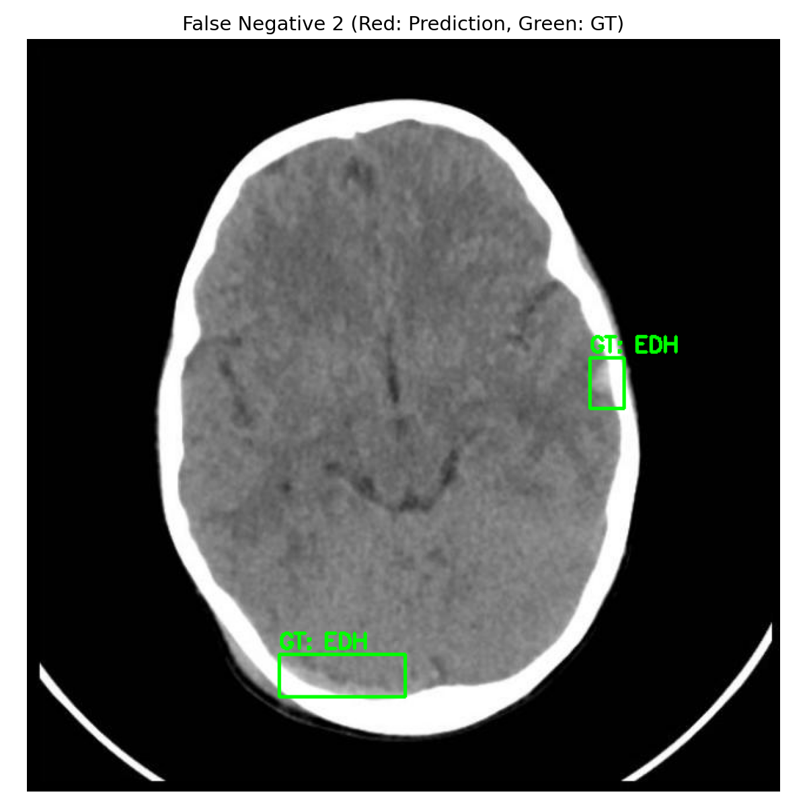  
  *Küçük kanama boyutu (mikrokanama) 640x640 çözünürlükte kaybolmuş.*
- **Örnek 3:**   
  *Kanamanın yoğunluğu çevresindeki dokuya çok benzediği için tespit edilememiş.*
- **Örnek 4:** 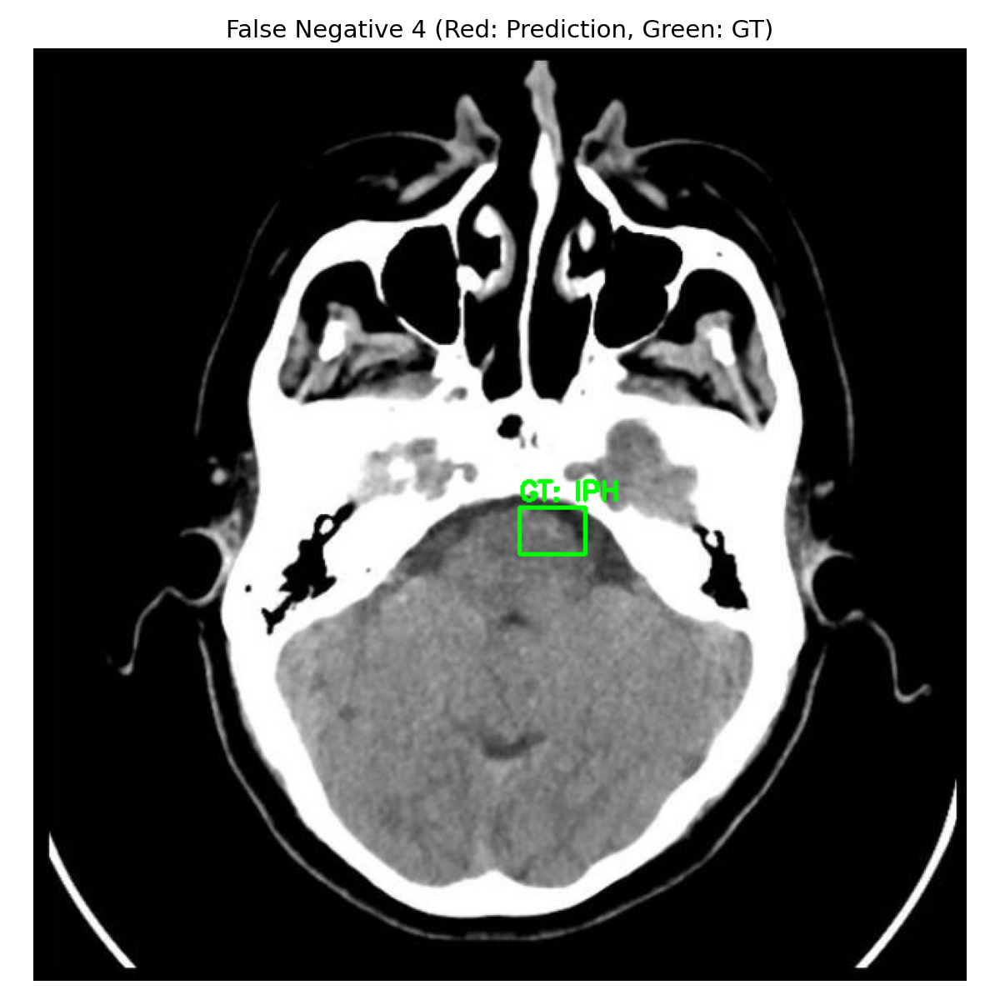  
  *Karmaşık anatomik bölgede (posterior fossa) gizli kalmış.*
- **Örnek 5:** 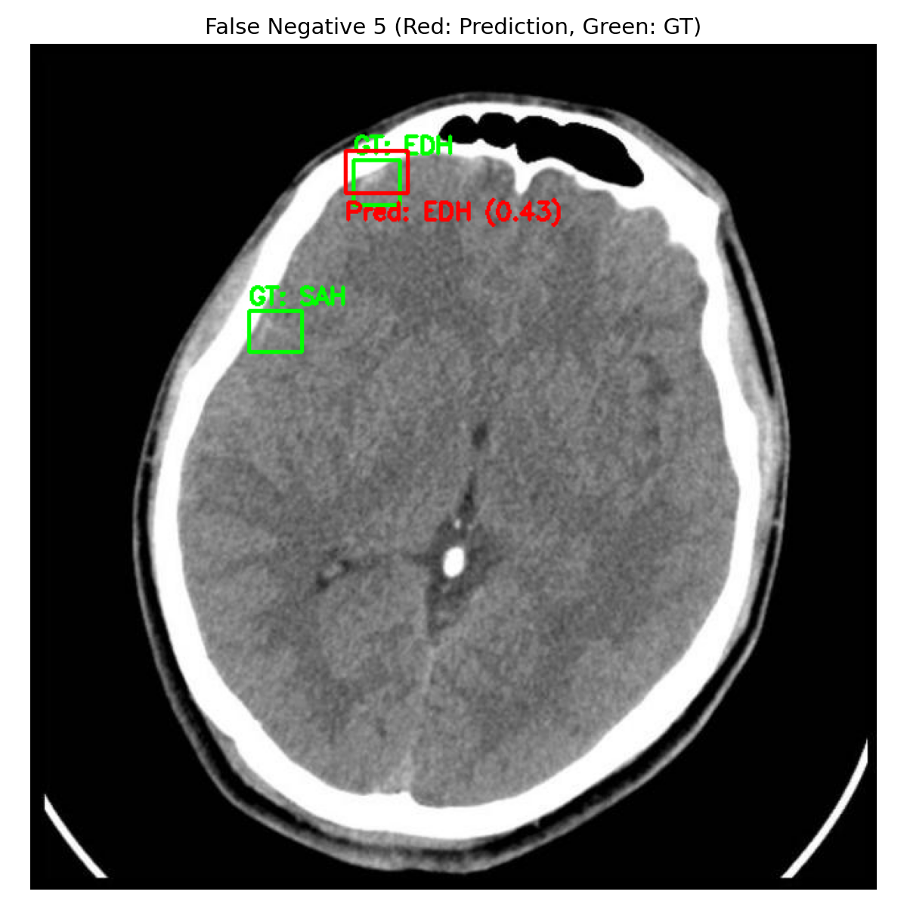  
  *Yaygın kanama (subaraknoid) sebebiyle BBox tespiti başarısız olmuş.*
- **Örnek 6:**   
  *Düşük kontrast gerçek kanamanın eşik altında kalmasına sebep olmuş.*

---

## 5. Uygulama Arayüzü (Web App) Çalıştırma

Eğitilen modelin gerçek zamanlı tahmin yeteneğini test edebilmek için, FastAPI destekli bir masaüstü/web arayüzü oluşturulmuştur. Bu arayüz üzerinden herhangi bir MR/Tomografi görüntüsünü yükleyerek modelin kanama tespit sınır kutularını (bounding boxes) ve güven skorlarını görsel olarak inceleyebilirsiniz.

**Komut:**
```bash
python run_app.py
```
*(Bu komut arka planda FastAPI sunucusunu başlatacak ve varsayılan internet tarayıcınızda otomatik olarak teşhis arayüzünü açacaktır. Kapatmak için terminalde `CTRL+C` yapabilirsiniz.)*
